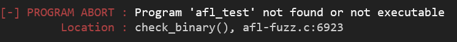
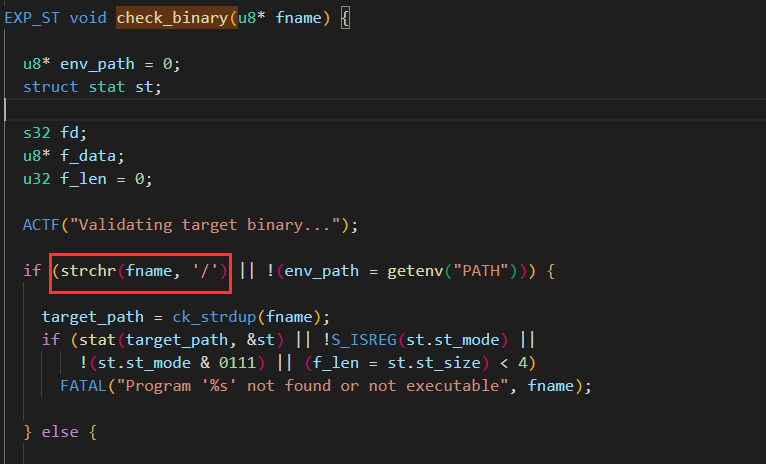
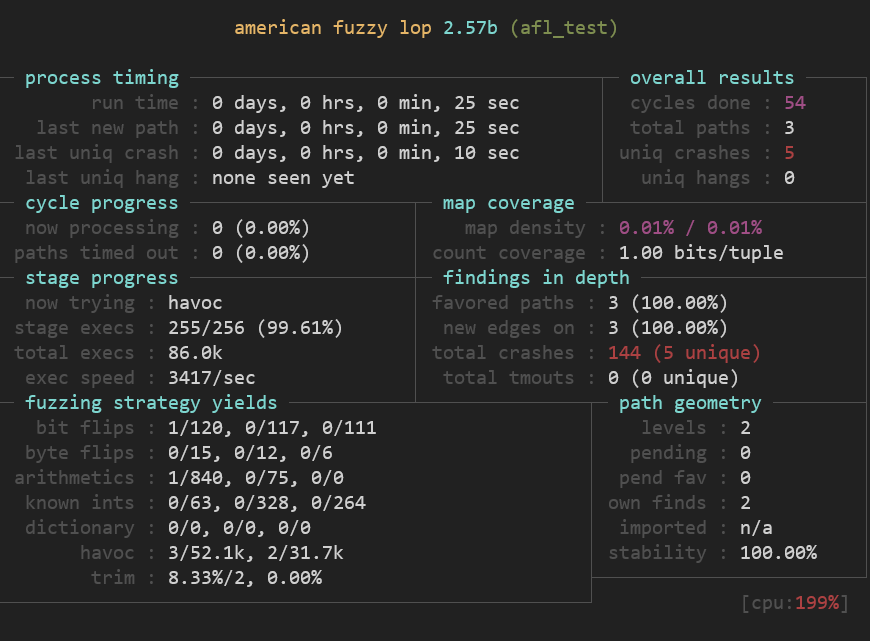
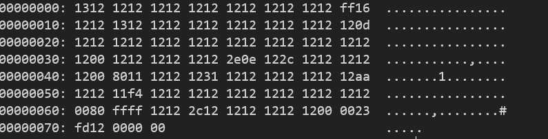
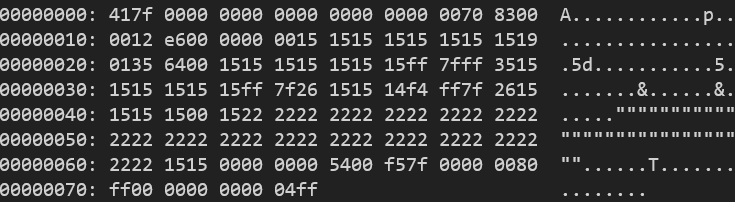
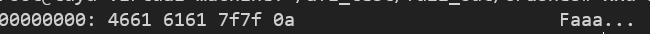

# Amearican Fuzzy Lop

> Fuzzing是指通过构造测试输入，对软件进行大量测试来发现软件中的漏洞的一种模糊测试方法。在现实的漏洞挖掘中，fuzzing因其简单高效的优势，成为非常主流的漏洞挖掘方法。
> 
> AFL则是fuzzing的一个很好用的工具，由Google安全工程师Michał Zalewski开发的一款开源fuzzing测试工具，可以高效地对二进制程序进行fuzzing，挖掘可能存在的内存安全漏洞，如栈溢出、堆溢出、UAF、double free等。由于需要在相关代码处插桩，因此AFL主要用于对开源软件进行测试。当然配合QEMU等工具，也可对闭源二进制代码进行fuzzing，但执行效率会受到影响。

## AFL初体验

```c
// AFL测试程序 存储路径~/afl_test/test
#include <stdio.h> 
#include <stdlib.h> 
#include <unistd.h> 
#include <string.h> 
#include <signal.h> 

int vuln(char *str)
{
    int len = strlen(str);
    if(str[0] == 'A' && len == 66)
    {
        raise(SIGSEGV);
        //如果输入的字符串的首字符为A并且长度为66，则异常退出
    }
    else if(str[0] == 'F' && len == 6)
    {
        raise(SIGSEGV);
        //如果输入的字符串的首字符为F并且长度为6，则异常退出
    }
    else
    {
        printf("it is good!\n");
    }
    return 0;
}
int main(int argc, char *argv[])
{
    char buf[100]={0};
    gets(buf);//存在栈溢出漏洞
    printf(buf);//存在格式化字符串漏洞
    vuln(buf);

    return 0;
}
```

## 目标程序处理

对目标程序进行编译插桩生成测试文件：

```
afl-gcc -g -o test test.c  
```

建立文件夹 fuzz_in/testcase & fuzz_out 用来存放程序的输入和fuzz的输出结果

 输入命令：```afl-fuzz -i fuzz_in -o fuzz_out ./test ```

从fuzz_in中读取输入，输出放入fuzz_out中，test为刚刚得到的插桩后的待fuzz程序

## 常见命令行参数整理

- -f ：testcase的内容会作为afl_test的stdin
- -m ：表示分配的内存空间
- -i ：指定测试样本的路径
- -o ：指定输出结果的路径
- /dev/null 使错误信息不输出到屏幕
- -t ：设置程序运行超时值，单位为 ms
- -M ：运行主(Master) Fuzzer
- -S ：运行从属(Slave) Fuzzer

## 报错

Sad-上来直接一个报错

 

不过C程序直接看源码也好理解：原来是测试文件得加‘/’

 

## Run



### 板块介绍

> [自己看官方文档吧](https://lcamtuf.coredump.cx/afl/status_screen.txt)

## Crash分析

Ctrl + c 退出进程开始分析crash吧

1. 符合栈溢出漏洞

 

2. 符合首字符为‘A’，字符长度为66的crash 

 

3. 符合首字符为‘F’，字符长度为6的crash

 

4. %n格式化字符串漏洞 

 